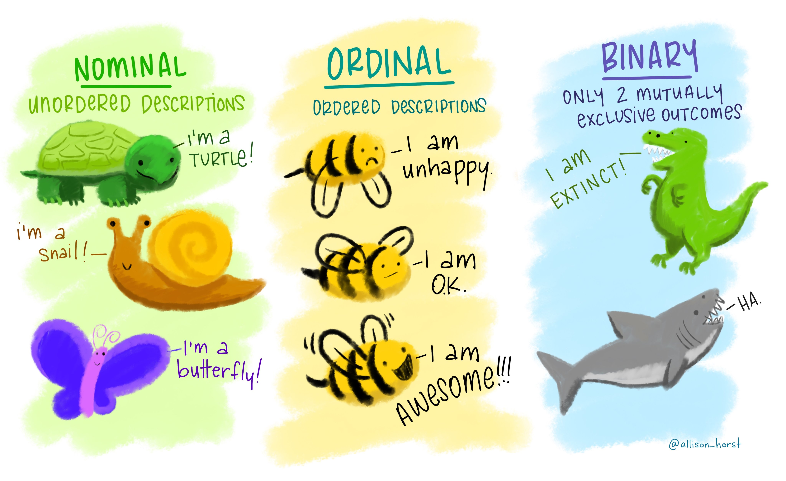

```{r include = FALSE}

## Just need to change up the 'firstday` for most semesters.

library(tidyverse)
library(lubridate)

firstday <- "2022-05-16"
    
meetings <- ymd(firstday) + c(0:11) * weeks(1)

meeting_headers <- paste0("Week ", 1:12, ", ", months(meetings), " ", day(meetings))

```

# Course Description

> "One of the beautiful things about science is that it allows us to bumble along, getting it wrong time after time, and feel perfectly fine as long as we learn something each time."

> Martin A. Schwartz (2008), ["The Importance of Stupidity in Scientific Research"](https://ir.stonybrook.edu/xmlui/bitstream/handle/11401/8083/schwartzimportanceofstupidityinscience.pdf?sequence=1)

Data is the lifeblood of public policy research. As the spending of public dollars increases, legislators need accurate, timely, and easily-accessible data to make informed decisions. To fulfill this responsibility, researchers have developed a variety of tools and data analysis methods. Every researcher relies on a range of these tools and methods to translate their study into policy and public policy recommendations. This course is designed to prepare incoming graduate students to examine policy issues and address policy research questions that will be important throughout their academic and professional careers. To do so, we will focus on the basics of economics and statistics, which come together to form the taproot of public policy. 

This class is conducted online.  It is constructed to provide a staged learning process and equip you with the information and tools you will need for the Master of Public Policy program and the MPP Certificate. This class is designed for students who have never taken an economics or statistics class in your previous academic studies or you took the classes many years ago and would like a refresher.  In this class, you will learn the fundamentals of economics and statistics to prepare you for taking the in-depth courses that are required for the program.

The online nature of the class will walk you through a series of video lectures, readings, group discussion threads and exams to assess what you have learned and prepare for upcoming courses. The class is divided into an Economics and Statistics component, each comprised of six modules.  For each module, you will go through a staged learning process, where you need to complete one of the tasks before moving on to the next task.  Each module will end with an exam to assess your learning. Importantly, each module is "gated," meaning you must complete the prior module before moving on. **There are due dates! But you are free to work ahead as needed to allow for vacations, holidays, and whatever else you have going on!**

\newpage

# Course Objectives



## Component 1 - Economics: 

The objective of the economics component of this course is to improve student understanding of the principles of microeconomic theory needed for public policy analysis, and to familiarize students with various ways in which theory can be applied to policy.

## Component 2 - Statistics:

The objective of the statistics component of this course is to equip students with basic calculation and interpretation skills used in statistical analyses and quantitative social science research.


### Office Hours

What are [office hours in an online class](https://vimeo.com/270014784)? I take a very liberal view of the word "office" and "hours." Most days, I'm literally sitting at a computer at home (or in a coffee shop on better days), webcam at the ready, and am happy to jump into a quick conversation with any student, at any time. Email me! You can either use the built-in Canvas messaging system, or email directly at ian.adams@utah.edu.

# Required Readings

In order to save you money, the program has decided this will be a *textbook free course*. This is a great benefit, because it means I can provide you all the readings for free. However, there can also be downsides, as sometimes the scanned items that are given to us by the library are not of the highest quality. Try to be patient, but if you run across a reading that is unusable, be prepared to use your Google sleuthing skills to figure out an equation or two (for example). All required readings and videos will be linked in the modules. Graduate education is at least in part about learning how to learn on your own, and in some cases you will need to go find information. **I cannot stress this enough - you will need to go find some information on your own**. It is not difficult to find, I promise, but will require some minimal effort on your part. 

# Canvas 

As this an online course, the course Canvas site is a virtual classroom and super syllabus all-in-one. There are several aids for addressing any technical difficulties experienced in Canvas, listed below. These are also linked to from the course Canvas site’s Help page. Please consult these aids before contacting instructors about technical difficulties.

- University of Utah [Canvas Orientation resources](https://utahtacc.zendesk.com/hc/en-us/articles/205654094)
- Online [Canvas Guides](https://community.canvaslms.com/community/answers/guides/)
- University of Utah IT Help Desk: 801-581-4000


# Weekly Schedule

This course is arranged into 'modules' for each week. Please see the Canvas course for details on each week.

## Economics Modules

###  `r meeting_headers[1]` : Thinking like an economist

###  `r meeting_headers[2]` : The market system and demand, supply and equilibrium

###  `r meeting_headers[3]` : Competition and monopolies

###  `r meeting_headers[4]` : Market failures - public goods and externalities

###  `r meeting_headers[5]` : Income inequality, poverty and discrimination

###  `r meeting_headers[6]` : Introduction to macroeconomics and measuring domestic output and national income

## Statistics Modules

###  `r meeting_headers[7]` : The what and why of statistics and frequency distribution

###  `r meeting_headers[8]` : Measures of central tendency and measures of variability

###  `r meeting_headers[9]` : Probability and normal probability distribution

###  `r meeting_headers[10]` : Introduction to inference and hypothesis testing

###  `r meeting_headers[11]` : Estimating population proportion and testing the difference

###  `r meeting_headers[12]` : Introduction to regression


Rejoice! There is no final!

# Course Policies

I will detail the policy for this course below. Academic honesty is expected, and dishonesty will not be tolerated. The University policy on academic dishonesty can be found on the university website. An act of academic dishonesty will result in a course grade of E and a recommendation of additional disciplinary action. The faculty has adopted the following guidelines concerning what constitutes a violation of ethical standards for work completed in this course. Any of these violations will be considered academic dishonesty and treated as such. These guidelines are in addition to any University-wide guidelines concerning academic dishonesty, which may be in effect. All course assignments will be scanned through Turnitin, and any misconduct will result in a failing grade for the course. 

1.	__Cheating__: the giving or receiving of any unauthorized assistance on any academic work;
2.	__Plagiarism__: presenting the language, structures or ideas of another person or persons as one’s own academic work;
3.	__Falsification__: Any untrue statement, either oral or written, concerning one’s own academic work or the academic work of another student, or the unauthorized alteration of any academic record; and
4.	__Original work__: Unless specifically allowed by the instructor, all academic work undertaken in a course must be original (i.e., it must not have been submitted in a prior course or be submitted in a course being taken concurrently).

## Course Work

Assignments vary by week/module. All assignments are located in the **Modules** section of the course. You must complete all the modules. There are due dates for every module! 

Every week you will have a lesson and an exam. Some weeks will also have mandatory discussion posts/replies, and there are three short research briefs scattered throughout the course (Modules 3, 4, and 10). Each module also has an ungraded practice exam. Though not worth points, it is required to complete before the next module will unlock!

Our class weeks begin on Monday and end on the following Sunday. Due dates are set for the Sunday at 11:59 p.m. **Pay particular attention to the end of the course** - because of the shortened summer semester, the last module (Module 12) only has a few days in it, so you either have to work ahead, or work very fast in the final week!

## Grading Policy

I use a standard grading scale to assign letter grades as computed by your percentage of points earned divided by the total points available. This class has *approximately* 638 points available through exams and assignments:

- *Economics Modules*: Six exams, two written assignments = **349 points**
- *Statistics Modules*: Six exams, one written assignment = **289 points**

Please keep in mind that these are approximations, and throughout the course I may modify the course and assignments points as needed. I will communicate any such changes through the Canvas course announcements.

## Attendance Policy

As this is an asynchronous, online class, there is no attendance policy *per se*. However, you must complete all of the course as assigned (see late policy below). You should plan on logging in at least a few times per week in order to successfully complete the course.

## Late Policy

Because this is a shortened semester, I have tried to develop a course that allows you to work *ahead* of the modules as needed to accommodate your personal and professional lives. However, there must still be a great deal of discipline on your part in order to be successful. Please keep up with the class schedule, especially with assignment due dates. Late assignments and projects will be subject to a **10% decrease in points for every day they are late**. This means that if you submit an assignment five days late, it will be worth just 50% of the earned points; ten days late means zero points. It is in your best interest to contact me beforehand if you are experiencing difficulties that will impact your ability to turn in work. However, you do not need to let me know if you will be turning in assignments late, just be aware of the 10% penalty/day impact to your score which will automatically be applied.

## Instructor Expectations

I commit to being your mentor and facilitator of the classroom experience, and to the following expectations for this course:

- I will design the course to include lectures, readings materials, and assignments that will challenge students and will provide them with opportunities to learn and practice course content.
- Though this online course includes pre-recorded lectures, it is not a class that is run “automatically” by technology. I interact with the class via announcements, virtual office hours, emails/the Canvas Inbox, feedback on assignments, and comments on lecture bulletin boards, among other methods.
- I will respond to emails in a timely fashion. “Timely” in this instance means within 48 hours, not including weekends and holidays. *Normally*, I am quite a bit faster, but like everyone else, life sometimes intervenes.
- I will be available for individual consultation via virtual office hours, email, or phone. Students will not be required to come to campus in order to meet with me, nor does it have to be during 'bankers hours.'
- I will provide feedback on the assignments in a timely manner.
- I will follow all [official University of Utah policies](https://registrar.utah.edu/handbook/) regarding conduct in the classroom, incompletes, and accommodations. Accommodations will be considered on an individual basis and only with required documentation. See the **University Policies** section at the end of this syllabus for more information and resources.

## Student Expectations

Though the online format allows students greater flexibility to complete their work, this course does have a structure and timeline, including due dates for course assignments. As such, the following is expected of all students in this class:

- Students will log in to the course a minimum of 3 times per week.
- Students may be expected to work with classmates; however, students are not expected to interact with their classmates in person. A good alternative to meeting in person would be online video conferencing, which allows students to find a time to meet that works best for their schedule. Depending on the assignment, students can also choose to interact with their classmates with whatever technology they are most comfortable with (Groupme, FaceTime, Google Hangouts, etc).
- To do well in online courses, students must be self-motivated, organized, and willing to stay on top of their schedule. Students should take control of their learning while in this course.
- Students will regularly check course announcements. The Announcements area is the instructor’s official means of communication when distributing information to the entire class.
- Students will [update their Canvas settings](https://support.tlt.utah.edu/hc/en-us) to ensure they receive timely notifications from the course.
- If students have any questions, are struggling with course materials, or need further assistance from their instructor, they will take the initiative to contact their instructor via the Inbox feature in Canvas or via email.
Email is not perfect; sometimes, messages sent to instructors are lost before they are read. If you do not hear back from your instructor 3 days after sending a message, please contact your instructor again.
- Students will engage with the course, students, and the instructor in a respectful and professional manner at all times.

## Netiquette

Students are expected to follow [the core rules of netiquette](http://www.albion.com/netiquette/corerules.html) at all times while participating in the class, interacting with other students, and communicating with the course instructor and teaching assistants. **Be kind**. 

## Technology Issues and Tech Help

I have invested a great deal of time before the start of the semester to ensure that the technologies used in this online class will operate smoothly. Nevertheless, technology doesn't always do what we want it to do! As such, this course has the following expectations regarding tech problems:

- Students are required to contact the instructor immediately when they notice broken links or inaccessible files in the course. Links and files are assumed to work, unless students indicate otherwise. Points lost on assignments, due to inaccessible links and files, cannot be made up if students did not notify the instructor of the problem prior to the assignment due date.
- The instructor is committed to fixing broken links and inaccessible files as soon as possible after being notified by the students. In the case that there will be a significant delay before these items can be fixed, the instructor will post an announcement to let the class know about the problem and to describe any alternate files/links or alternate due dates for assignments, if applicable, that students should be aware of.
- Students are responsible for submitting all assignments and activities by their due dates. In the very rare case that technical problems prevent a student from submitting an assignment, students are required to—
Immediately contact their instructor via email or the Canvas Inbox, to let them know about the problem and to submit a copy of their assignment as an attachment (where possible). Then, immediately contact the Canvas help desk to troubleshoot and resolve the problem.
- Submit an email updating the instructor on whether the problem was resolved and of any additional steps the student or instructor needs to take to get the assignment properly submitted to Canvas.
- It is not appropriate to send an email to your instructor informing them about tech problems after an assignment due date. 
- Students are expected to read all assignment instructions and to submit work in the required file formats. Work submitted as improper file formats will not be considered to have been handed in on time. The instructor will only grade work submitted using the proper file format.
- It is the student's responsibility to reach out to the appropriate help desk to troubleshoot and resolve tech problems in the course,

# University Policies

It is my intent that students from all diverse backgrounds and perspectives be well served by this course, that students’ learning needs be addressed both in and out of class, and that the diversity that students bring to this class be viewed as a resource, strength, and benefit. It is my intent to present materials and activities that are respectful of diversity: gender, sexuality, disability, age, socioeconomic status, ethnicity, race, and culture. Your suggestions are encouraged and appreciated. Please let me know ways to improve the effectiveness of the course for you personally or for other students or student groups. In addition, if any of our class meetings conflict with your religious events, please let me know so that we can make arrangements for you. The following resources and statements are drawn directly from the University of Utah guidelines. If you have questions or concerns not answered below, please contact me directly so we can work together to answer and address them.

(@)	*Accommodation of Sincerely Held Beliefs*:  I will work with students who require schedule changes due to religious or other significant obligations. I will not consider any requests based on course content. No other area of study touches on more sensitive topics than the broad category of "public policy" (and at times disturbing forms of human misbehavior such as criminal law). Policy researchers must read about, talk about, and listen to information relating to very difficult subjects. Sometimes case descriptions can be quite graphic. Students are required to attend all classes and to read all the assignments. All assignments and lectures are related to our subject matter.

(@)	*The Americans with Disabilities Act*. The University of Utah seeks to provide equal access to its programs, services, and activities for people with disabilities. If you will need accommodations in this class, reasonable prior notice needs to be given to the [Center for Disability Services](https://disability.utah.edu/), 162 Olpin Union Building, (801) 581-5020. CDS will work with you and the instructor to make arrangements for accommodations. All written information in this course can be made available in an alternative format with prior notification to the Center for Disability Services.

(@)	*University Safety Statement*. The University of Utah values the safety of all campus community members. To report suspicious activity, call campus police at 801-585-COPS (801-585-2677). You will receive important emergency alerts and safety messages regarding campus safety via text message. For more information regarding safety and to view available training resources, including helpful videos, visit safeu.utah.edu. 

(@)	*Addressing Sexual Misconduct*. Title IX makes it clear that violence and harassment based on sex and gender (which Includes sexual orientation and gender identity/expression) is a civil rights offense subject to the same kinds of accountability and the same kinds of support applied to offenses against other protected categories such as race, national origin, color, religion, age, status as a person with a disability, veteran’s status or genetic information.  If you or someone you know has been harassed or assaulted, you are encouraged to report it to the Title IX Coordinator in the Office of Equal Opportunity and Affirmative Action, 135 Park Building, 801-581-8365, or the Office of the Dean of Students, 270 Union Building, 801-581-7066.  For support and confidential consultation, contact the Center for Student Wellness, 426 SSB, 801-581-7776.  To report to the police, contact the Department of Public Safety, 801-585-2677(COPS).

(@)	*Undocumented Student Support Statement*. Immigration is a complex phenomenon with broad impact—those who are directly affected by it, as well as those who are indirectly affected by their relationships with family members, friends, and loved ones. If your immigration status presents obstacles to engaging in specific activities or fulfilling specific course criteria, confidential arrangements may be requested from the Dream Center. Arrangements with the Dream Center will not jeopardize your student status, your financial aid, or any other part of your residence. The Dream Center offers a wide range of resources to support undocumented students (with and without DACA) as well as students from mixed-status families. To learn more, please contact the Dream Center at 801.213.3697 or visit the [Dream Center website](https://d.docs.live.net/88e07230498ff330/dream.utah.edu).

(@)	*Veterans’ Center*. If you are a student veteran, the U of Utah has a Veterans Support Center located in Room 161 in the Olpin Union Building. Hours: M-F 8-5 pm. Please visit their website for more information about what support they offer, a list of ongoing events, and links to outside resources: [Veteran's Center](http://veteranscenter.utah.edu/). Please also let me know if you need any additional support in this class for any reason.

(@)	*Wellness Statement*. Personal concerns such as stress, anxiety, relationship difficulties, depression, cross-cultural differences, etc., can interfere with a student’s ability to succeed and thrive at the University of Utah. For helpful resources, contact the Center for Student Wellness or call at 801-581-7776.

(@)	*English Language Learners*. If you are an English language learner, please be aware of several resources on campus that will support you with your language and writing development. These resources include the [Writing Center](http://writingcenter.utah.edu/), the [Writing Program](http://writingprogram.utah.edu/), and the [English Language Institute](http://continue.utah.edu/eli/). Please let me know if there is any additional support you would like to discuss for this class.

(@)	*LGBT Resources*: I am committed to inclusivity and respect for all students in the classroom, including and not limited to LGBT individuals. Additionally, the University of Utah has an LGBT Resource Center located in the Olpin Union Building, Room 409. Their website contains more information about the support they offer, a list of events, and links to additional resources: LGBT Resources.

(@)	*Names/Pronouns*. Class rosters are provided to the instructor with the student’s legal name as well as “Preferred first name” (if previously entered by you in the Student Profile section of your CIS account). While CIS refers to this as merely a preference, I will honor you by referring to you with the name and pronoun that feels best for you in class or on assignments. Please advise me of any name or pronoun changes so I can help create a learning environment in which you, your name, and your pronoun are respected. If you need any assistance or support, please reach out to the LGBT Resource Center: [LGBT Resources](http://lgbt.utah.edu/).

(@)	*Drop/Withdrawal*.  Please check the academic calendar for more information pertaining to dropping and withdrawing from a course. Withdrawing from a course, and other matters of registration, are the student’s responsibility. 

(@)	*Student Code*: http://regulations.utah.edu/academics/6-400.php

(@)	*Accommodation Policy (see Section Q)*: http://regulations.utah.edu/academics/6-100.php

(@) *COVID-19 Campus Guidelines*. Students are required to self-report if they test positive for COVID-19. To report, please contact: **COVID-19 Central @ The U**, 801-213-2874, [coronavirus.utah.edu](coronavirus.utah.edu). To reduce the spread of COVID-19 on campus, face coverings are required in all in-person classes for both students and faculty. Based on CDC guidelines, the University requires everyone to wear face coverings in shared public spaces on campus. If you repeatedly fail to wear a face covering in class, you may be referred to the Dean of Students for a possible violation of the Student Code. Some courses may require attendance due to hands-on coursework. Please read the syllabus and attendance requirements for the course thoroughly. Some students may qualify for accommodations & exemptions from these guidelines through the Americans with Disabilities Act (ADA). Accommodations should be obtained prior to the first day of class.If you believe you meet these criteria, contact:

>If you believe you meet these criteria, contact:
Center for Disability & Access
 801-581-5020
disability.utah.edu 
162 Union Building
200 S. Central Campus Dr.
Salt Lake City, UT 84112


